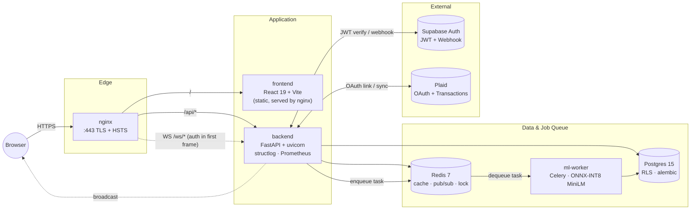

# Finance Tracker

A full-stack personal finance application: link bank accounts (via Plaid), import and
auto-categorize transactions with an ML model, track budgets and goals, and watch a
dashboard update in real time over WebSockets.

The project began as a 40-day internship build and then went through a multi-week
**production-hardening phase** (security, performance, observability, testing). This
README is the entry point; deeper material is linked under [Documentation](#documentation).

> **New here? Run it:** follow [`RUN.md`](RUN.md) — a four-step `make prod-up` recipe.

---

## Architecture



A browser talks to **nginx** (TLS), which serves the static React app and proxies
`/api/*` and the `/ws/*` WebSocket lane to **FastAPI**. FastAPI uses **Postgres**
(row-level security, Alembic migrations) and **Redis** (cache, pub/sub for real-time
fan-out, distributed locks). Heavy ML categorization is enqueued to a **Celery
ml-worker** that runs a quantized MiniLM model. **Supabase** provides authentication
and **Plaid** provides bank linking. More diagrams (ER model, security topology,
observability, container topology) live in [`docs/audit/diagrams/`](docs/audit/diagrams/),
and there is a full draw.io diagram at [`DiagramModel.drawio.svg`](DiagramModel.drawio.svg).

## Tech stack

| Layer | Technologies |
|---|---|
| Frontend | React 19, TypeScript, Vite, Tailwind CSS, Zustand, TanStack Query, Recharts/Nivo, Sentry |
| Backend | Python, FastAPI, SQLAlchemy, Alembic, Pydantic, Supabase auth (JWT) |
| ML worker | Celery, sentence-transformers (MiniLM), ONNX Runtime (INT8) |
| Data | Postgres 15 (RLS), Redis 7 |
| Infra | Docker Compose, nginx (TLS/HSTS), Prometheus + Grafana + Loki (observability) |
| Tooling | Makefile, GitHub Actions CI, Vitest, pytest (+ testcontainers), Playwright (e2e) |

## Quick start

Prerequisites: Docker Desktop and a free Supabase project (for auth). Then:

```bash
make tls-cert     # one-time self-signed certs for local HTTPS
make prod-up      # build + start the full stack
# open https://localhost/
make prod-down    # stop
```

Full setup, troubleshooting, and the Supabase/Plaid env details are in [`RUN.md`](RUN.md).
`make help` lists all targets.

## Tests

```bash
make test-backend     # pytest + testcontainers (real Postgres/Redis)
make test-frontend    # vitest
make test-ml-worker   # pytest (model load skipped for speed)
```

- Backend tests: [`backend/tests/`](backend/tests/) — integration, security (RLS leak,
  rate limits, encryption), concurrency, and contract suites (see
  [`backend/tests/README.md`](backend/tests/README.md)).
- Frontend tests: [`frontend/tests/`](frontend/tests/) — Vitest with MSW.
- End-to-end: [`e2e/`](e2e/) — Playwright.

## Repository layout

| Path | What |
|---|---|
| `backend/` | FastAPI app, services, auth, migrations, tests |
| `frontend/` | React + Vite SPA |
| `ml-worker/` | Celery worker + ML inference |
| `e2e/` | Playwright end-to-end tests |
| `nginx/`, `ops/`, `docker-compose*.yml` | Edge, observability, and orchestration |
| `benchmarks/` | Performance benchmarks |
| `docs/` | Audit, integration changelogs, runbooks (see below) |

## Documentation

| Document | Purpose |
|---|---|
| [`RUN.md`](RUN.md) | How to run the stack locally |
| [`REPORT.md`](REPORT.md) | End-of-phase report (production-hardening) |
| [`docs/audit/`](docs/audit/) | Risk register (`findings.csv`), diagrams, metrics |
| [`docs/integration/`](docs/integration/) | Per-wave changelogs of the hardening work |
| [`docs/runbooks/`](docs/runbooks/) | Operations: backup, TLS, encryption, security checklist |
| [`AUDIT_FINDINGS.md`](AUDIT_FINDINGS.md) | Latest code-review findings + remediation status |
| `internship.md`, `newreport.md` | Historical internship reports (Turkish) — see [`AUDIT_FINDINGS.md`](AUDIT_FINDINGS.md) |

## Project status

This is a portfolio / internship project, **not** a production deployment. It is
intentionally hardened well beyond a typical demo (RLS, encryption at rest, CSRF,
rate limiting, observability, a real test pyramid), but some items are deliberately
left to an operator — real TLS certificates, off-site backups, and an httpOnly-cookie
auth migration among them. The honest, prioritized list of what is solid and what is
still open is in [`AUDIT_FINDINGS.md`](AUDIT_FINDINGS.md) and
[`docs/audit/findings.csv`](docs/audit/findings.csv).
