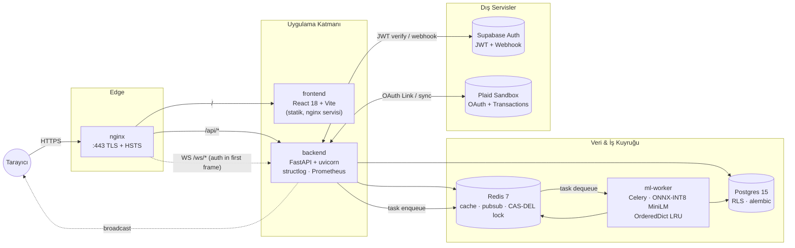

# Şekil 1 — Sistem Mimarisi (Yüksek Seviye)

Tarayıcıdan başlayarak veri ve kontrol akışı: nginx (TLS 443 + HSTS) →
React SPA + FastAPI; Postgres / Redis / ml-worker iç ağda; Supabase ve
Plaid dış servisler. WebSocket lane gerçek zamanlı güncellemeleri,
Celery lane ML işlerini taşır.

## Kanıt ve Çapraz Referanslar

- nginx + 443 + HSTS: `nginx/nginx.conf`, `docs/integration/12-operator-items.md`.
- Backend ile uçtan uca güvenlik kontrolleri: `docs/audit/diagrams/security-topology.md`.
- Konteyner topolojisi (volume / network ayrımı): `docs/audit/diagrams/prod-compose.md`.
- Gözlemlenebilirlik kanalları (OTel → Grafana): `docs/audit/diagrams/observability-flow.md`.
