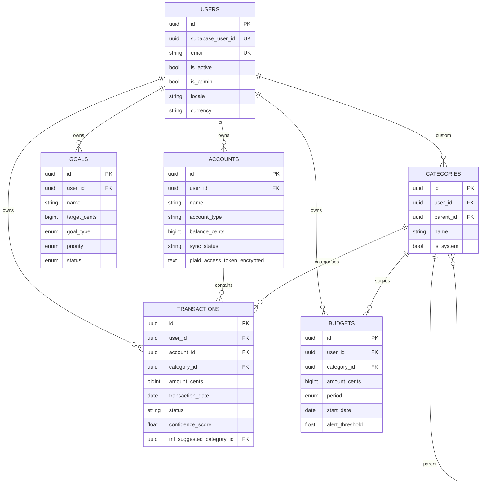

# Şekil 2 — Veri Modeli (Çekirdek Tablolar)

`backend/app/models/*.py` altındaki SQLAlchemy 2.0 modellerinden
türetilmiştir. Sadece çekirdek tablolar ve temsilî alanlar gösterilmiştir;
detay alanları (Plaid metadata, lokalizasyon vb.) sade kalsın diye
gizlenmiştir.

Para birimi için `amount_cents` BigInteger — kayan nokta kullanılmadığına
dikkat (kaynak: `transaction.py:23`).

## Kanıt ve Çapraz Referanslar

- Tablo kaynakları: `backend/app/models/{user,account,transaction,category,budget,goal}.py`.
- Para birimi cent olarak saklama gerekçesi: `backend/app/models/transaction.py:23`.
- RLS bağlamı (`user_context_db()`): `docs/audit/improvement-sections/F-security.md` ve
  `docs/audit/diagrams/security-topology.md`.
- W3'te eklenen ek indeksler: `backend/migrations/versions/a1b2c3d4e5f6_audit_catchup_indexes.py`.
- BE-PERF-008 fonksiyonel indeks (`abs(amount_cents)`):
  `backend/migrations/versions/b2c3d4e5f6a7_functional_abs_amount_cents_index.py`.
