# Şekil 6 — Öncesi / Sonrası: Faz Çıktıları

Bu rapor için "öncesi / sonrası" karşılaştırması iki sayı kümesinden
oluşur: (a) yapısal sertleştirme metrikleri (test sayıları, multi-stage
imajlar, kapalı bulgular) ve (b) çalıştırma metrikleri (p95 gecikme, LCP,
inferans). Birinci küme `baseline.md` ve `improved.md` içinde doğrudan
mevcut; ikinci küme harness olarak hazırdır ancak canlı çalıştırma
operatör görevidir (bkz. `docs/audit/metrics/improved.md` §"Deferred").

Aşağıdaki şekil yalnızca (a) kümesini görselleştirir; (b) için
yer tutucu satır bırakılmıştır.

## 6a. Yapısal İyileştirmeler (Kapanmış Sayı)

```mermaid
xychart-beta
    title "Faz Öncesi vs Faz Sonrası — Yapısal Metrikler"
    x-axis ["BE testleri", "FE testleri", "ML testleri", "E2E testleri", "Multi-stage imajlar"]
    y-axis "Sayı" 0 --> 30
    bar [14, 0, 0, 0, 0]
    bar [23, 20, 6, 7, 3]
```

Mermaid'in `xychart-beta` bloğu render etmezse aşağıdaki tablo aynı
veriyi sunar:

| Metrik | Öncesi | Sonrası | Δ |
|---|---:|---:|---|
| Backend test dosyası | 14 (SQLite-mock, bit-rot) | 23 (testcontainers Postgres+Redis) | +9 ve **14'ü baştan yazıldı** |
| Frontend test dosyası | 0 | 20 (Vitest + MSW + RTL) | +20 |
| ml-worker test dosyası | 0 | 6 | +6 |
| E2E spec | 0 | 7 (Playwright + axe-playwright) | +7 |
| Multi-stage Dockerfile | 0 | 3 (`backend`, `ml-worker`, `frontend`) | +3 |
| `.env.example` sızıntısı | 4 canlı anahtar | 0 (placeholder) | -4 |

## 6b. Risk Kaydı — Kapanma Oranı

```mermaid
xychart-beta
    title "findings.csv — Şiddete Göre Kapanma"
    x-axis ["P0", "P1", "P2"]
    y-axis "Bulgu sayısı" 0 --> 35
    bar [18, 33, 28]
    bar [18, 23, 5]
```

| Şiddet | Toplam | Kapalı | Açık / Ertelenmiş |
|---|---:|---:|---|
| P0 | 18 | 18 | 0 / 0 |
| P1 | 33 | 23 | 5 / 5 |
| P2 | 28 | 5 | 19 / 4 |

*P2 açıklarının büyük çoğunluğu erişilebilirlik genişletmeleri, ek FE
performans kazanımları ve ek ML telemetrisi gibi nice-to-have'lar; risk
değil, ileri faz işidir.*

## 6c. Çalıştırma Metrikleri (Operatör Görevi)

| Metrik | Hedef | Durum |
|---|---|---|
| API p50 / p95 (`/transactions`, `/dashboard/summary`) | < 200 ms p95 | Harness hazır (`benchmarks/backend/`); canlı koşum bekleniyor |
| Frontend LCP / TBT / bundle KB | LCP < 2.5 s | Lighthouse CI 0.14 entegre (`benchmarks/frontend/`); canlı koşum bekleniyor |
| ML inferans p50 / p99 | p99 < 50 ms | `pytest --benchmark-only` (`benchmarks/ml-worker/`); model yüklü koşum bekleniyor |

Çalıştırma rakamları geldiğinde bu bölüm `docs/audit/metrics/runtime.md`
kaynaklı somut sayılarla güncellenir.

## Kanıt ve Çapraz Referanslar

- Yapısal sayıların kaynağı: `docs/audit/metrics/baseline.md` ve `improved.md`.
- Risk kaydı: `docs/audit/findings.csv` (faz sonu durumu).
- Harness yerleşimi: `benchmarks/{backend,frontend,ml-worker}/` ve
  `docs/integration/05-benchmarks.md`.
