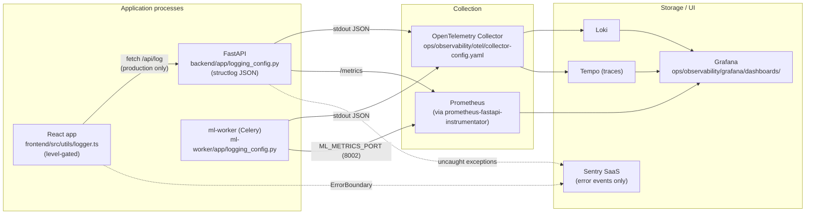
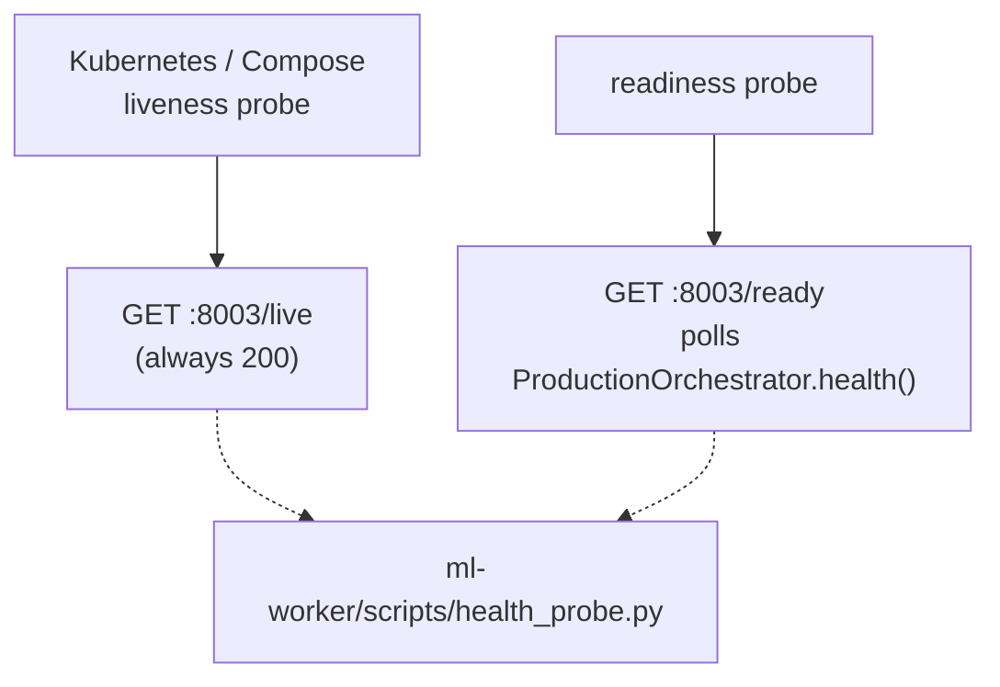

# Observability flow (post-W5)

Cited findings: BE-LOG-001..004, FE-LOG-001..002, ML-LOG-001, INFRA-OBS-001..002.

## Compose wiring

`docker-compose.observability.yml` (repo root) brings up the OTel collector,
Prometheus, Loki, Tempo, and Grafana with mounts at `./ops/observability/...`.
`docker compose -f docker-compose.observability.yml config -q` is part of IW-7
verification.

## Health / liveness

