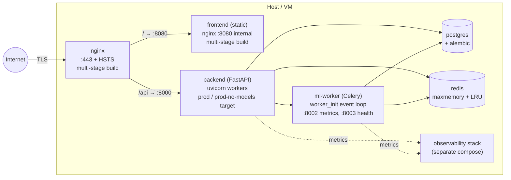

# Production compose topology (post-W6)

Cited findings: INFRA-DOCK-001..005, INFRA-NGINX-001..002, BE-PR-001..006,
FE-PR-001..005, ML-PR-001..005.

## Image layout

Both backend and ml-worker Dockerfiles ship two prod targets:
- `prod`: bakes the ONNX-INT8 model + safetensors prototypes into the image.
- `prod-no-models`: leaves models out; `ml-worker/scripts/fetch_models.sh`
  pulls them from object storage at container start. Lets the same image
  run in environments with different model SLAs.

## Operator follow-ups (deferred)

These are intentionally **not** wired in compose; they require infra the
team owns:

| Item | Where | Status |
|---|---|---|
| Real TLS certs | `nginx/ssl/` | INFRA-NGINX-001 deferred — operator |
| Backup S3 bucket | `make backup` cron | INFRA-BACKUP-001 deferred — operator |
| `git filter-repo` for ml_models history | repo root | ML-PR-005 deferred — operator |
| react-window install | `frontend/package.json` | FE-PERF-003 deferred — operator (`npm install`) |
| Alembic catchup baseline migration | `backend/migrations/` | BE-PR-001/002 deferred — operator (needs fresh DB) |
