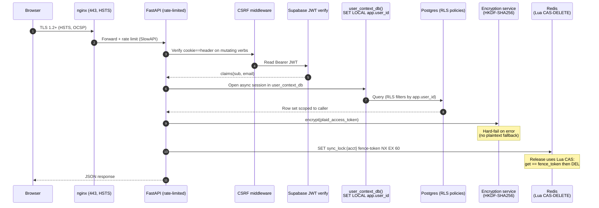
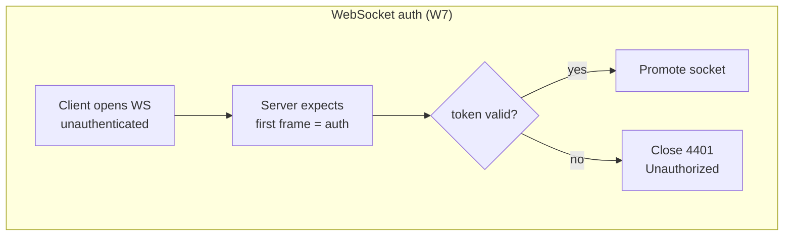

# Security topology (post-W7)

How an authenticated request flows through the hardened backend, and where each
W7 control sits. Cited findings: BE-SEC-001..009, FE-SEC-001..004,
BE-CONC-001..002, BE-RL-001.

## Mapping to findings

| Layer | Control | Finding(s) closed |
|---|---|---|
| nginx 443 + HSTS | TLS termination | INFRA-NGINX-002 |
| SlowAPI | per-route rate limits | BE-RL-001 |
| CSRF middleware | double-submit cookie + header | FE-SEC-001..003, BE-SEC-005 |
| Supabase JWT | `verify_supabase_token`, dev bypass gated | BE-SEC-002 |
| `user_context_db()` | async generator, SET LOCAL inside the with-block | BE-SEC-001 |
| `_provision_user_from_supabase` | INSERT … ON CONFLICT to fix TOCTOU | BE-CONC-001 |
| HKDF-SHA256 + typed `EncryptionError` | hard-fail; configurable hex salt | BE-SEC-003, BE-SEC-006 |
| Redis fence tokens (Lua CAS-DELETE) | sync-lock release safety | BE-CONC-002 |
| WS first-frame auth, close 4401 | WS handshake | BE-WS-001 (closed via FE-WS-001 fix), BE-SEC-008 |
| `.env.example` scrubbed | no live secrets | BE-SEC-004 |
| safetensors prototype I/O | no untrusted pickle | ML-SEC-001 |
