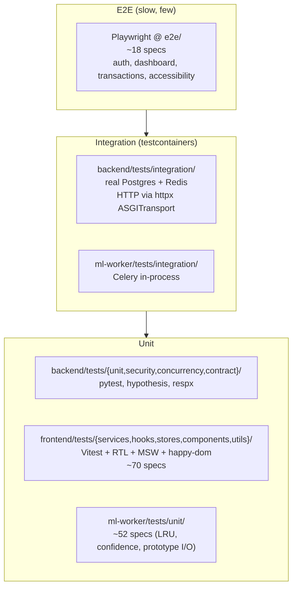
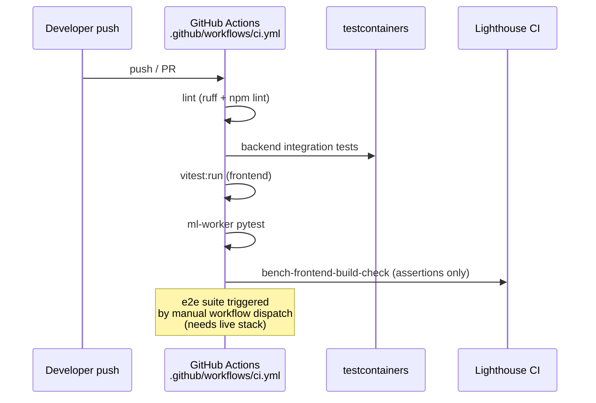

# Test pyramid (post-W4 + IW-1)

Cited findings: BE-TEST-001..005, FE-TEST-001, ML-TEST-001.

## Tooling per tier

| Tier | Backend | Frontend | ML-worker |
|---|---|---|---|
| Unit | pytest, hypothesis, respx, freezegun | Vitest, RTL, MSW, happy-dom | pytest, numpy fixtures |
| Integration | testcontainers (Postgres + Redis), httpx ASGITransport | Vitest with MSW network mocks | Celery test app |
| E2E | — | Playwright + axe-playwright + axe-core | — |
| Bench | Locust, pytest-benchmark | Lighthouse CI 0.14, bundle-visualizer | pytest-benchmark for inference |

## CI flow

## Concurrency group

`name: ci` with `concurrency: ${{ github.ref }}` cancels prior runs on new
pushes — saves CI minutes.
